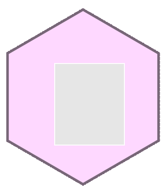

```{r, include = F}
# This is the recommended set up for flipbooks
# you might think about setting cache to TRUE as you gain practice --- building flipbooks from scratch can be time consuming
knitr::opts_chunk$set(fig.width = 6, message = FALSE, warning = FALSE, comment = "", cache = F, fig.retina = 3, dev.args = list(bg = "transparent"))
library(flipbookr)
library(tidyverse)
```

---

# Welcome!

This is a 'the-making-of' type flipbook.  We'll see how the *animated* {flipbookr}  hex sticker is made with {ggplot2} and [{magick}](https://cran.r-project.org/web/packages/magick/vignettes/intro.html), a great image manipulation package.  

--

As I'm writing this welcome, the animated hex sticker isn't fully put together -- the animation bit is yet to come, but I'm confident we can get it done (maybe with a for loop - that's the quick way for me - you might find it ugly).  

--

The idea is to put a series of images inside the hex, and present as a gif.


---

# Warm up: using {magick} to prepare background image for these slides

--

For this flipbook, I wanted to try to use the cover image throughout the entire slide deck, but a washed out version.  Lore Abad and collaborators do this in their [spatial networks slides](https://sfnetworks.github.io/sfnetworks-webinar/slides#1) and they look fantastic.  They use [xaringanthemer]() to do so. 

--

Having a image background is actually helpful to demonstrate what's transparent in images and what's not.  

--

Let's look at the preparation of this background image which will give you a feel for how to get things done with {magick}.  


---

`r chunk_reveal("prepare_background")`

```{r prepare_background, include = F}
# Shilo Labelle is the photographer in BC Canada
honey_comb <- "https://images.unsplash.com/photo-1566236057428-7e68793aef51?ixlib=rb-1.2.1&ixid=eyJhcHBfaWQiOjEyMDd9&auto=format&fit=crop&w=1567&q=80"

magick::image_read(honey_comb) %>% 
  magick::image_colorize(opacity = 90, 
                         color = "snow1") %>% 
  magick::image_write(path = "background.png")
```

---


```{r xaringan-themer, include = F}
xaringanthemer::style_mono_accent(
  # hex color should be provided, or theme_xaringan doesn't work
  base_color = '#ffa500', #orange
  title_slide_background_image = "https://images.unsplash.com/photo-1566236057428-7e68793aef51?ixlib=rb-1.2.1&ixid=eyJhcHBfaWQiOjEyMDd9&auto=format&fit=crop&w=1567&q=80",
  background_image = "background.png",
  code_font_size = '14px',
  text_slide_number_color = '#b3b3b3', #grey70
  link_color = '#ff4500', #orangered  
  footnote_font_size = '0.5em',
  footnote_position_bottom = "30px",
  code_highlight_color = "#ffedcc", #faded-orange
  extra_css = list(
    ".pull-left-70" = list("float" = "left", "width" = "65.8%"),
    ".pull-right-30" = list("float" = "right", "width" = "28.2%"),
    ".pull-left-30" = list("float" = "left", "width" = "28.2%"),
    ".pull-right-70" = list("float" = "right", "width" = "65.8%"),
    ".orange" = list("color" = "#ffa500"),
    ".note" = list("font-size" = "0.8em", "position" = "absolute", 
      "bottom" = "30px", "padding-right" = "4em")
  )
)
```


---
class: center, middle

# Building a hex canvas with ggplot2

---

`r chunk_reveal("build_hex")`


```{r build_hex, include = F}
tibble(x = c(-sqrt(3)/2, -sqrt(3)/2, 0, 
             sqrt(3)/2, sqrt(3)/2, 0),
       y = c(0.5, -0.5, -1, -0.5, 0.5, 1)) ->
hex_vertices

hex_vertices %>% 
  # closing it up for the polygon
  slice(1) %>% 
  bind_rows(hex_vertices,
            .) %>% 
  ggplot() +
  aes(x = x) +
  aes(y = y) +
  geom_polygon(color = "thistle4",
               size = 3,
               fill = "thistle1") +
  coord_equal() +
  theme_void() ->
g

ggsave(
  filename = "hex_background.png",
  plot = g,
  bg = "transparent" # don't forget this guy
  )
```


---
class: center, middle

# Building a hex *frame* only with ggplot2

--

I'm not sure that I will use this, but maybe.

---


`r chunk_reveal("build_hex_frame")`


```{r build_hex_frame, include = F}
hex_vertices %>% 
  # closing it up for the polygon
  slice(1) %>% 
  bind_rows(hex_vertices,
            .) %>% 
  ggplot() +
  aes(x = x) +
  aes(y = y) +
  geom_polygon(
    color = "palegreen4",
    size = 3,
    # for a frame only 
    fill = "transparent" 
    ) +
  coord_equal() +
  theme_void() ->
g

ggsave(
  filename = "hex_frame.png",
  plot = g,
  bg = "transparent" # don't forget this guy
  )
```


---

# Build the contents of the hex sticker

We'll put a ggplot build created with flipbookr inside the hex sticker. 

---

`r chunk_reveal("cars_flipbook")`

```{r cars_flipbook, include = F}
cars %>% 
  ggplot() +
  ggthemes::theme_solarized(base_size = 15) +
  aes(x = speed) +
  aes(y = dist) +
  geom_point(size = 6,
             fill = "plum4",
             shape = 21, 
             alpha = .75) +
  labs(title = "The 'cars' dataset") +
  labs(subtitle = "Speed and Stopping distance are correlated") +
  labs(x = "Speed (mph)") +
  labs(y = "Distance (feet)") +
  theme(plot.title.position = "plot") +
  cowplot::draw_label(label = "flipbookr", ) ->
p1

cowplot::ggdraw(p1) +  
  cowplot::draw_label("Flipbookr", color = "#D0B0B0",
             size = 100, angle = 45)
```

---

## The still images:

```{r stills, code = flipbookr::chunk_code_seq_as_vector("cars_flipbook"), fig.show="hold", echo = F, results="hide", out.width="14.2%"}

```


---

# Composites - hex background and plot

---

`r chunk_reveal("build_animated_hex")`

```{r build_animated_hex, include = F}
the_path <- "hex_sticker_making_files/figure-html/"  
the_path %>%  
  list.files(path = .,  
           pattern = "cars_flipbook_auto") ->  
  plot_pngs  

magick::image_read(paste0(the_path, "/", plot_pngs)) %>%  
  magick::image_scale(geometry = "X170") ->  
the_steps  

magick::image_read("hex_background.png") %>%  
  magick::image_scale(geometry = "X400") %>%  
  magick::image_composite(the_steps, offset = "+112+130") %>%  
  magick::image_write_gif(path = paste0("my_animated_hex.gif"),
                          delay = .4)  
```

---

`r chunk_reveal("animation", break_type = 1)`

```{r animation, include=F}

```


---

# the static hex sticker

Now let's have a look at the static hex sticker that Britt Woodrum created.  Someone at the RStudio conference suggested that instead of hex stickers, I should create hex pads of paper! Great idea, a bit ambitious.  But that was a source of inspiration.

Britt pushed for hex branding after watching the ["The development of 'datos' package for the R4DS Spanish translation"](https://rstudio.com/resources/rstudioconf-2020/the-development-of-datos-package-for-the-r4ds-spanish-translation/).  The creators of "datos" prioritzed the hex sticker!

Britt worked on several version and we've kind of settled on this one.  I love what Britt created!  Colors were inspired by the RLadies Xaringan theme - which I used pretty consistently in the early flipbooks.  Emi Tanaka's pick really.  

---

`r chunk_reveal("britt")`

```{r britt, include=F}
magick::image_read("flipbook_sticker_britt.png") %>% 
  magick::image_rotate(10) %>% 
  magick::image_rotate(-20) %>% 
  magick::image_rotate(20) ->
  rotated

magick::image_read("flipbook_sticker_britt.png")
```


---


Thank to these folks for ideas and how-to (link):

- Britt Woodrum
- [Brian Shalloway](https://github.com/EvaMaeRey/flipbookr/issues/21)
- [Alison Presmanes Hill](https://arm.rbind.io/slides/xaringan.html#90)
- [Guangchuang Yu and hexSticker](https://github.com/GuangchuangYu/hexSticker) - this package has been used to create many hex stickers - a quick way to build your sticker!

And to creators and contributors to:

- ggplot2
- xaringan
- xaringanthemer
- [magick](https://cran.r-project.org/web/packages/magick/vignettes/intro.html)


```{css, eval = TRUE, echo = FALSE}
.remark-code{line-height: 1.5; font-size: 80%}

@media print {
  .has-continuation {
    display: block;
  }
}
```
